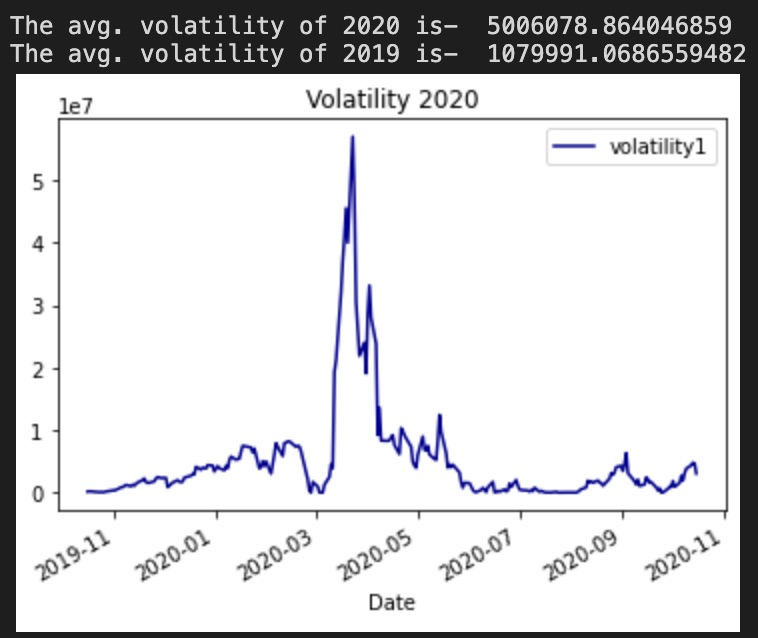
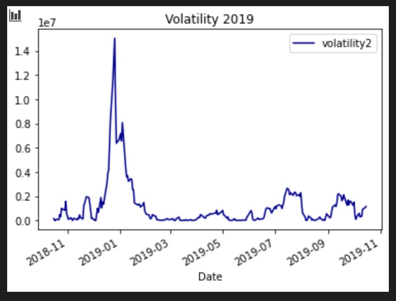
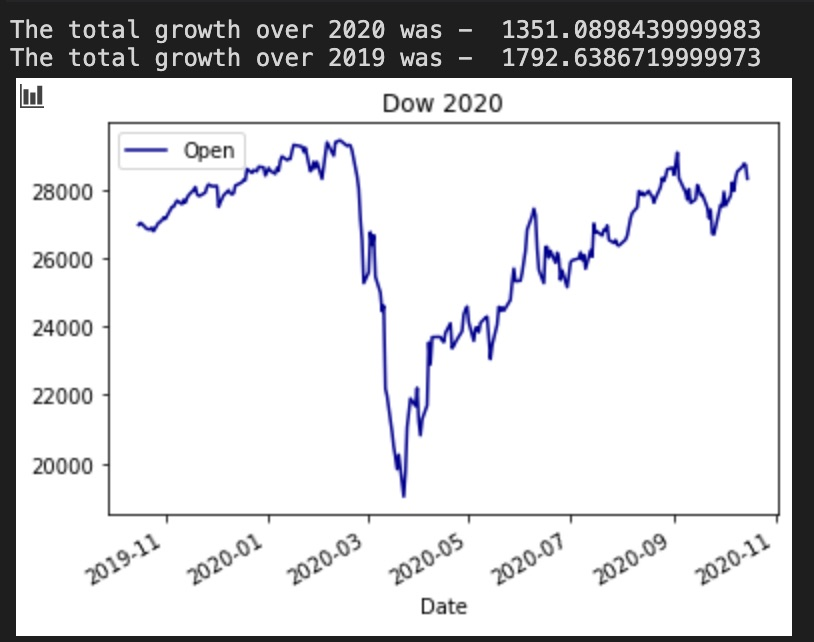
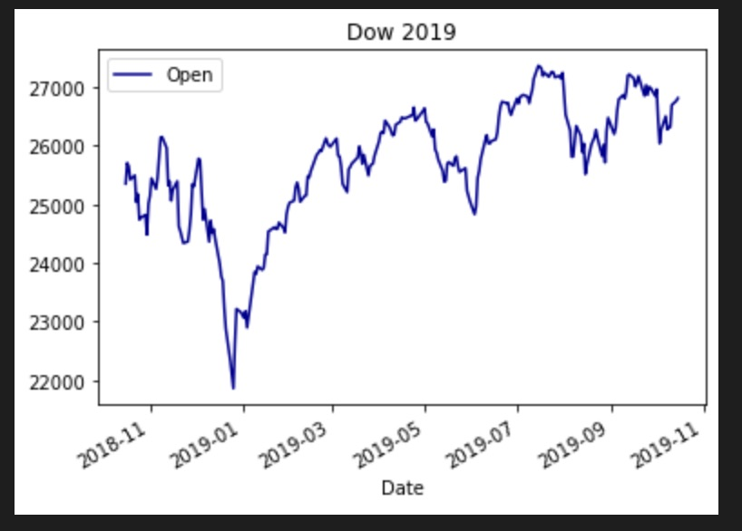
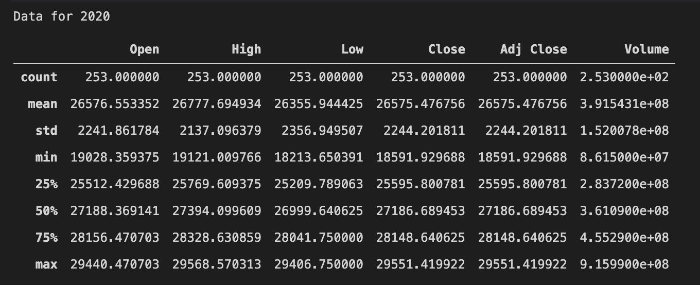
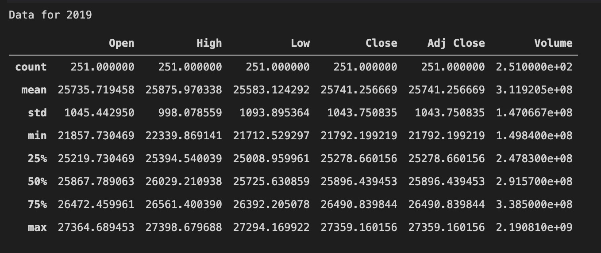

# Overview

This program imports and analyzes data from the last two years of the Dow Jones stock. In stocks, the volatility is the measure of the dispersion of returns for a given security or index. For investors higher volatility actually can often correspond to higher returns. This program analyzes and plots this years volatility as compared to last years. It also plots the overall movement of the Dow, and how much has been gained on the year.

# Development Environment
* Visual Studio Code
* python 3.8.3
* Jupyter extension

# Execution
To execute the program run the notebook dataScience.ipynb.

The first section is used to calculate the volatility and will have these outputs.

Notice how the charts match the finding that the volatility of 2020 is 5 times larger.

The second section shows the over all growth with the following graphs and data.

The final two sections output some basic data about the data set including the mean and standard deviation.

# Useful Websites
* https://pandas.pydata.org/
* https://finance.yahoo.com/quote/DOW?p=DOW&.tsrc=fin-srch

